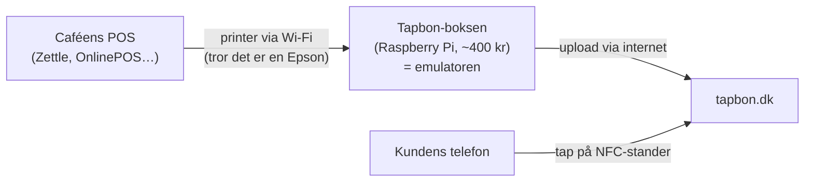

# Spec v2: Printer-emulering — "Tapbon Bridge" (fil-først)

**Purpose:** POS-systemet "printer" til Tapbon i stedet for papir. Vi integrerer mod
**printerprotokollen, ikke POS-systemet** — én kerneintegration, alle POS-systemer.
v2-ændring vs v1: **fang printjobbet som fil (PDF/PNG) først**, parse ESC/POS til
strukturerede data senere. Prototype = software (virtuel printer / laptop på port 9100),
hardware (Pi-klasse boks) genbruger samme API uændret.

## Arkitekturprincip
Backend er ligeglad med kilden. Alt ender som samme *receipt job*:
`{ terminalId, printJobId, receivedAt, source: usb|network|virtual-printer|manual,
format: escpos|pdf|png, file }`. Windows-app, laptop-emulator, Pi og fremtidig custom
hardware rammer samme endpoint.

## Hos kunden

Engangsopsætning (~30 min): caféen opretter sig på tapbon.dk og genererer
enheds-nøgle i dashboardets Bridge-kort → boksen (Pi — eller din laptop under
pilot) får nøglen og kobles på caféens Wi-Fi → i POS'ens printerindstillinger
tilføjes "Epson"-printer på boksens IP → NFC-stander ved terminalen. Hvert
salg: medarbejder trykker print som altid → boksen fanger og uploader →
kunden tapper inden 90 sek. → kode på POS-skærm matcher telefonen.

## Datamodel
- `terminals` **er** devices: + `deviceTokenHash` (SHA-256 af bearer-token, vises én
  gang), + `lastSeenAt`. `publicId` er allerede tap/NFC-identiteten.
- `receipts`: + `kind: 'structured' | 'file'`, + `confirmationCode` (4 cifre),
  + `status/expiresAt/claimedAt` (leverings-metadata, undtaget immutabilitet),
  + `printJobId` (unik pr. terminal = idempotens).
- `receipt_files` (bytea i Postgres — tenant-policy tvinger storage-kontoen
  netværkslukket ligesom Key Vault, så Blob er parkeret): fil + mimeType + size.
  Fil-kvitteringer hasher **filens bytes** (SHA-256) i stedet for receipt-JSON —
  immutabilitet (hard rule 1) holder. VAT-breakdown/CVR (hard rule 3) gælder
  `structured`; en `file`-kvittering viser POS'ens egen print (som indeholder
  moms/CVR) og mærkes "rå kvittering" i UI.

## API (bridge ↔ SaaS — samme for software og hardware)
`POST /api/bridge/receipts` — `Authorization: Bearer <deviceToken>`, multipart:
fil + printJobId + timestamp. Svar: `{ receiptId, confirmationCode, expiresAt }`.
Idempotent på (terminal, printJobId). Nyt job udløber tidligere `pending` jobs.

## Claim-flow (/t/[publicId], skærpet)
1. Tap → find terminalens nyeste `pending` kvittering inden for vinduet (10 min —
   hævet fra 90 s efter pilot-feedback; kvitteringen gemmes for evigt, vinduet
   styrer kun tap-udlevering).
2. Claim er **én atomisk UPDATE** (status pending→claimed WHERE status='pending') —
   første tap vinder, kan aldrig re-claimes til anden telefon.
3. `confirmationCode` vises både i bridge-status (kasseskærm) og på telefonen,
   så kunde/medarbejder kan matche: "Kvittering 4821".
4. Ingen pending → venteskærm med retry (som i dag).

## Bridge-klienten (softwareprototype — kan bygges af ekstern udvikler)
Lokal service (laptop/Windows/Pi) der: (1) lytter på TCP 9100 + annoncerer sig via
mDNS/Bonjour som Epson TM-m30II (se docs/pos-test-plan.md for Zettle/OnlinePOS-
testplan), (2) detekterer job-grænser (cut-kommando/timeout), (3) renderer ESC/POS →
PNG *visuelt* (escpos-tools/escpresso som reference, aldrig dependency), (4) uploader
med deviceToken, (5) kø lokalt ved netfejl + retry, (6) svarer ACK/"online, paper OK"
altid — POS må aldrig se en printerfejl.

## Faser
1. **SaaS-siden (vores slice):** schema-kolonner, Blob upload, `/api/bridge/receipts`,
   claim-skærpelse + confirmationCode, fil-kvittering på `/r/[id]`.
2. **Emulator (test, ingen kunde):** Python/Node 9100-lytter → pass Zettle-testplanen.
3. **Pilot:** laptop/Pi hos kunde, valgt som "Digital kvittering"-printer i deres POS.
4. **Senere:** ESC/POS→structured parse (opgraderer `file`→`structured`), hardware-boks.

## Out of scope (v1)
Papir-passthrough, AirPrint/IPP, StarPRNT-dialekt, Bluetooth/USB-emulering, OTA,
POS-API'er, org/locations-hierarki (merchants+terminals rækker). Parkeres i ROADMAP.md.

## Byg-rækkefølge
SaaS-siden (fase 1) kan bygges nu — den er også fundamentet for manuel test-upload.
Fase 2–3 kræver kun testplanen + en tablet med Zettle Go (~0 kr). Hardware først
når fil-flowet er bevist hos en pilot.
